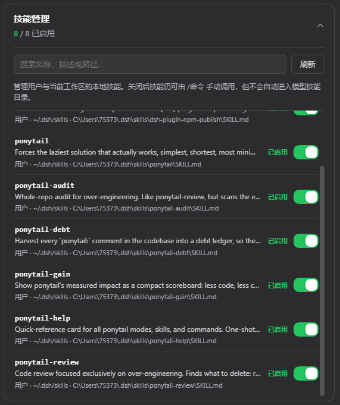

# dsh-skill-manager

DSH Web 的本地技能管理插件。

## 界面位置

**设置 → 插件 → 「插件配置」标签页 → 顶部的「技能管理」卡片**

装好并重启 `dsh web` 后就能看到这张卡片。它**默认收起**（与官方插件卡片一致，收起时标题栏仍显示 `已启用 / 总数`），点标题栏展开；展开后可搜索技能、切换每项技能的模型自动调用开关。



*图为展开后的样子。*

## 功能

- 扫描用户技能：`~/.dsh/skills`、`~/.agents/skills`
- 扫描当前活动工作区：`.dsh/skills`、`.agents/skills`
- 卡片头样式与官方插件卡片一致，可展开／收起
- 按名称、描述、路径搜索
- 启用或禁用技能的模型自动调用
- 修改后由 DSH 技能目录热刷新，无需重启

“禁用”会把技能 frontmatter 中的 `disable-model-invocation` 设为 `true`。技能仍可通过 `/技能名` 手动调用；重新启用时该字段设为 `false`。

## 兼容性

**需要的 DSH：`>= 0.1.5-rc.1`**（开发与验证版本：`0.1.5-rc.1`）

| 插件版本 | 需要的 DSH | 验证于 |
| --- | --- | --- |
| `v0.1.0` | `>= 0.1.5-rc.1` | `0.1.5-rc.1` |

要求写在 `package.json` 的 `dsh.engines.dsh` 字段里（也支持顶层 `engines.dsh`，两者同时存在时顶层优先）：

```jsonc
"dsh": {
  "engines": { "dsh": ">= 0.1.5-rc.1" }
}
```

读取方是 dsh 插件市场（dsh-market）：它在插件发现页展示该要求，并在**确认不兼容时**拒绝安装／更新。需要说明的是 `dsh plugin add` 自身**不校验**这个字段——装到过旧的 DSH 上不会报错，所以请自行确认版本。

## 安装

从 GitHub 安装：

```sh
dsh plugin --profile web add github:SiriusWJ/dsh-skill-manager
```

本地开发安装：

```sh
dsh plugin --profile web add link:/absolute/path/to/dsh-skill-manager
```

安装插件后重启 `dsh web`，客户端模块才会载入。重启后按上面的[界面位置](#界面位置)打开卡片。

## 安全边界

- API 只接受 loopback 请求。
- 写操作要求浏览器同源。
- 客户端提交的路径只作为身份声明；写入前会重新扫描并核对技能名与完整路径。
- 同名技能按 DSH 官方优先级只显示当前有效项：项目 `.dsh` → 项目 `.agents` → 用户 `.dsh` → 用户 `.agents`。
- 技能根中的符号链接视为用户主动挂载；启停会跟随链接并原子改写真实目标，即使目标位于技能根之外。
- 使用临时文件加原子改名更新 `SKILL.md`，避免文件监听器读到半写状态。

## 开发

```sh
npm install
npm run verify
```

## 参考

实现思路参考了 [zhu1090093659/dsh-web 的 dsh-skill-explorer](https://github.com/zhu1090093659/dsh-web/tree/main/packages/dsh-skill-explorer)，本插件只保留“本地技能列表 + 启用/禁用 + 设置页卡片”这条最小路径。

## License

MIT
